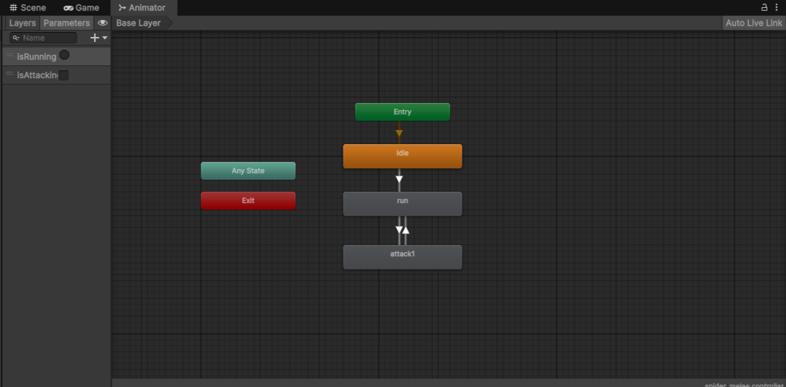

# CISC_486_Project
This is the GitHub repository for our course project in CISC 486. 

Assignment #2: FSM

Link to video demo: https://youtu.be/vQOx-CvCsIs

Assignment #3: NPC

Link to video demo: https://youtu.be/-GRgh2_eTqQ

Assignment # 4: Networking

Link to video demo: https://youtu.be/54GY1T4n01M

Setup and Run instructions:
Step 0: Select the Networking-Gameplay branch as your operating code.
Step 1: locate and open the ParrelSync tab on the top of the unity editor then open the tab and select clone manager.
Step 2: In the clone manger select create clone, if none are pesent.
step 3: With the present clone click open in new editor.
step 4: Arrange the screens to your liking.
step 5: Run the Main Menu Scene from the Scenes folder in Assets. Both instances will have to be started on their own.
Notes: 
The main editor will always be the server, with the clones being clients 
Demo video begins with a Step and Run follow along if there if needed.

Diagram of FSM:

Description of FSM:

The Finite State Machine is composed of 3 main states:
1. Idle 
2. Run 
3. Attack

There are also two boolean conditions: isRunning & isAttacking.

The first state is Idle, when the enemy is not moving as they do not detect player near them. When the player gets within the detection radius to the enemy, the state transitions from idle to run. This transition sets the isRunning boolean from false to true. In this state the enemy is now chasing after the player. The enemy will stay in this state until they get close enough to the player to where they start attacking them, triggering the isAttacking boolean to switch from false to true. The enemy will stay in this state until the player gets far enough away from them, at which point the enemy will transition back to the previous state. 

CISC 486 Project Proposal

1. Game Title 

a. The Riftkeepers

2. Core Gameplay 

Players will participate together in a fight for survival as they have to defeat AI enemies that are chasing them. Players can walk or sprint, and they can collect various objects and weapons scattered around the map to use in defeating enemies. The enemies come in waves, and it becomes harder to survive each wave as the enemies' health increases, along with the number of enemies that spawn. 

3. Game Type 

The type of game is primarily a survival game, along with a bit of collection and puzzle elements. The player's main objective is to survive, and they have to collect different weapons that can help them in that goal. Some of these weapons/objects will be locked behind puzzles or challenges that the player(s) have to complete. The enemies spawn out of portals that are located throughout the map, and in order to win the game, the players need to defeat the bosses, who will drop keys that will allow the portal doors to be locked. 

4. Player Setup 

Players on a gameplay level will directly control a character as they navigate and fight enemy NPCs. Players will primarily control their characters through mouse and keyboard controls. We are not currently looking to implement controllers or any other capability. As we get further into development, we are planning on implementing cooperative multiplayer features to allow for multiplayer. We are looking at implementing this for both local instances and multi-instance, through networking. We plan to limit this feature to 4 players at max. We are not sure if we will try to get local and network at the same time (example: connecting to local instances through a network, that both have 2 local players each for 4 total).  

5. AI Enemies (NPCs) 

We currently only have major plans for implementing enemy NPCs, who will follow a basic script and pathing. The basic enemy will have 3 states: Idle, Chase, and Dying.

Idle, relates to an enemy that is on the map, but has not seen the player and thus will follow a static script for patrol and wander.

Chase, relates to an enemy that has seen a player. Their script will now update to follow the players movement and continuously path towards them.

Dying relates to a killed enemy, at this point there are no movements. However, this is where death animations alongside player reward and other related triggers will take place.

State will flow as depicted in the following FSM.

(Click the following link to view the document with the FSM, onQ will not let us add it here):
https://docs.google.com/document/d/1BaOjCEWDhOL1YU6rCublqULfTyQmjp86qurAyak-93U/edit?usp=sharing

Currently we are still looking into developing more complex enemy types that may see more or less states, such as bosses.

There are no current plans to implement friendly NPCs who will take actions.

6. Scripted Event

Every few minutes, a boss will spawn near the player and engage in combat with them.

The player will level up after gaining a certain amount of experience upon defeating enemies, gaining power-ups.

Upon defeating three bosses, the player will trigger an endgame sequence in which they fight against the final boss. The monster spawner will appear once the player has defeated the final boss, which they can seal by interacting with it, beating the game.

7. Environment 

The game takes place in a hostile fantasy environment, specifically a forest, where the player finds themselves surrounded by waves of monsters. In the beginning, a few giant spiders attack the character, but as time progresses, stronger enemies start attacking in greater numbers. There are a few things that can be found around the forest, such as healing stations and temporary buffs. These will encourage the player to move around the map, rather than staying in the same spot.

8. Basic Planning Factors

We plan on getting the majority of our assets from the Unity Asset Store. We feel that we can find the majority of things that we need from there, and it will make integration easier as we are developing the game in Unity Game Engine. For anything that we cannot find on Unity Asset Store, we may also utilize the website itch.io, which has free assets available for use. Animations can also be found through Mixamo for free.

Team Members: 

Faheem Lakhani, ID: 20236064

Josh Phillips, ID: 20228486

Jawad Ahmed, ID: 20231174

Team roles:

Faheem: Will plan group meetings, submit assignments, and participate in game development

Josh: Will ensure all files are correctly uploaded to GitHub, and participate in game development

Jawad: Will find the assets that we will use during development, and participate in game development. Will work on asset creation, specifically UI and menu design.

9. Timeline

Week 3: 

Project planning and finding assets 

Week 4: 

Creating a basic scene

Implementing player controllers and the first enemy AI

Week 5: 

Refining the player controller and model

Adding objectives and basic UI

implementing weapons and power-ups

Week 6: 

Improving environment

creating more enemy types

adding more weapons and power-ups

Week 7: 

Add effects/particles and UI design

Implement art direction and stylized look

Week 8: 

Creating the final boss

Week 9: 

Refine NPC State machines

Creating menu

Finishing touches, complete game

Week 10: 

Networking

Week 11 & 12: 

Refining and polishing the game

Week 3: 

Playtesting, finding and fixing any bugs in the game

Submitting the final project

Contribution Statement

For this assignment, each member of the group contributed a fair share to the final product. Faheem was in charge of discussing the core gameplay, game type, and basic planning assets. Josh completed the player setup and AI enemies section, and Jawad completed the scripted event, environment, and timeline sections. All members of the group contributed during group meetings, and everyone got a chance to share their ideas until a consensus was agreed on.

